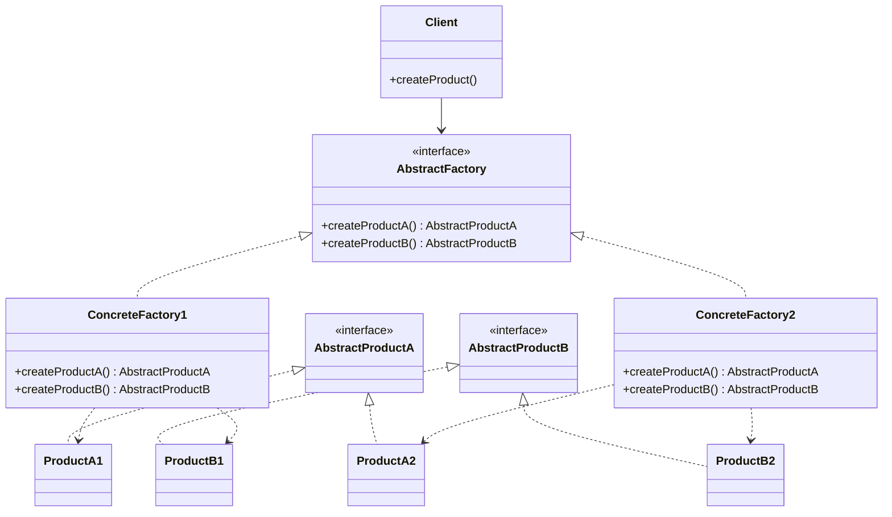

# Abstract Factory Pattern

## Description
The Abstract Factory pattern provides an interface for creating families of related or dependent objects without specifying their concrete classes. It's a creational pattern that works around a super-factory which creates other factories.

## UML Diagram

## Components

### Client
- Uses interfaces declared by AbstractFactory and AbstractProduct classes

### AbstractFactory
- Declares an interface for operations that create abstract product objects

### ConcreteFactory1, ConcreteFactory2
- Implement the operations to create concrete product objects

### AbstractProductA, AbstractProductB
- Declare interfaces for a type of product object

### ProductA1, ProductA2, ProductB1, ProductB2
- Define products created by corresponding ConcreteFactory
- Implement the AbstractProduct interface

## When to Use
- When a system should be independent of how its products are created, composed, and represented
- When a system should be configured with one of multiple families of products
- When a family of related product objects is designed to be used together
- When you want to provide a class library of products, and you want to reveal just their interfaces, not their implementations

## Benefits
- Isolates concrete classes
- Makes exchanging product families easy
- Promotes consistency among products
- Supporting new kinds of products is difficult

## Real-world Example
In the Head First Design Patterns book (2nd Edition), the Abstract Factory pattern is exemplified through pizza ingredient factories. Different regions (like New York and Chicago) have their own concrete factories that create appropriate ingredients (dough, sauce, cheese, etc.) for their style of pizza.

## Implementation Notes
- Typically implemented with Factory Methods, though Prototype is also possible
- Often a singleton since only one instance is needed

## Related Patterns
- Factory Method: Often used in implementation
- Singleton: ConcreteFactories are often singletons
- Prototype: Can be used for the concrete factory implementation