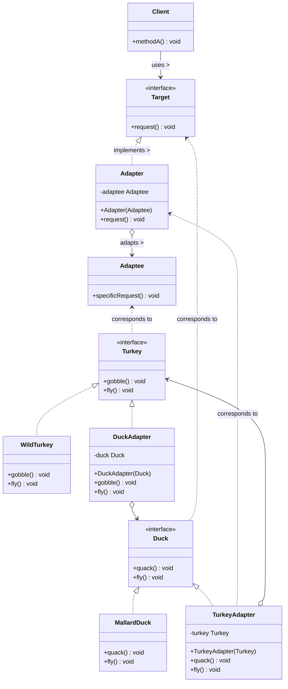

# Adapter Pattern

## UML Diagram

## Adapter Pattern Explanation

The Adapter Pattern converts the interface of a class into another interface that clients expect. It allows classes to work together that couldn't otherwise because of incompatible interfaces.

### Key Components

1. **Target (Duck)**: The interface that the client uses directly.
2. **Adaptee (Turkey)**: The interface that needs to be adapted.
3. **Adapter (TurkeyAdapter)**: The class that implements the Target interface and translates client requests into calls on the Adaptee object.
4. **Client**: Collaborates with objects conforming to the Target interface.

### How It Works

1. The client makes a request to the Adapter by calling a method on it using the Target interface.
2. The Adapter translates the request into one or more calls on the Adaptee using the Adaptee interface.
3. The client receives the results of the call and is unaware of the Adapter's presence.

### Real-World Analogy

Think of an electrical adapter that allows you to plug a US device (Adaptee) into a European outlet (Target). The adapter (Adapter) makes the incompatible interfaces work together without changing either the US device or the European outlet.

### Benefits

- Allows the use of existing classes with incompatible interfaces
- Lets classes work together that couldn't otherwise
- Enhances reusability of existing code
- Separates the client from the implementation details of the adapted class
