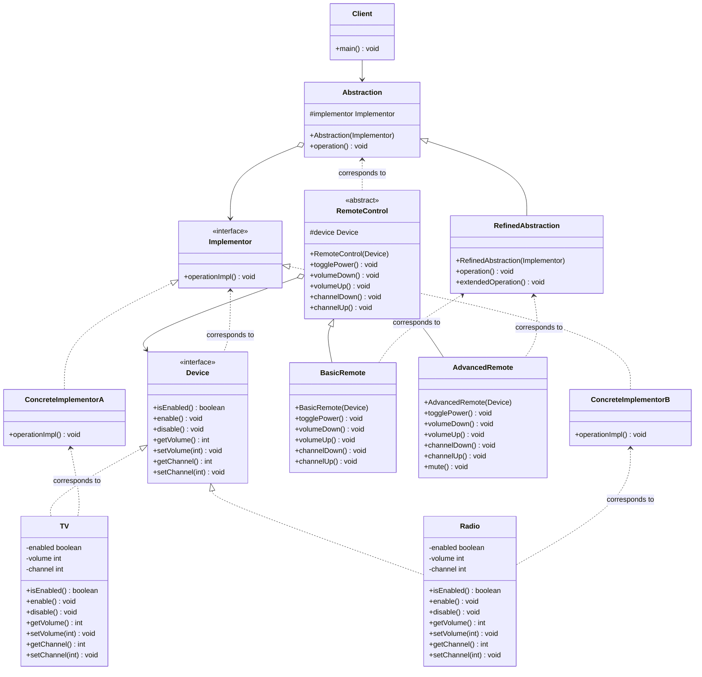

# Bridge Pattern

## UML Diagram



## Bridge Pattern Explanation

The Bridge Pattern decouples an abstraction from its implementation so that the two can vary independently. It is used mainly for implementing platform independence features.

### Key Components

1. **Abstraction (RemoteControl)**: Defines the abstraction's interface and maintains a reference to an object of type Implementor.
2. **RefinedAbstraction (BasicRemote, AdvancedRemote)**: Extends the interface defined by Abstraction.
3. **Implementor (Device)**: Defines the interface for implementation classes. This interface doesn't have to correspond exactly to Abstraction's interface.
4. **ConcreteImplementor (TV, Radio)**: Implements the Implementor interface and defines its concrete implementation.

### How It Works

The Bridge pattern creates "two layers of abstraction" that can evolve independently:

1. **Abstraction Layer**: The remote control hierarchy (BasicRemote, AdvancedRemote)
2. **Implementation Layer**: The device hierarchy (TV, Radio)

Instead of creating a class for every combination (BasicRemoteTV, AdvancedRemoteTV, BasicRemoteRadio, etc.), the Bridge pattern allows you to compose these hierarchies dynamically.

### Sample Usage

```java
// Create different devices
Device tv = new TV();
Device radio = new Radio();

// Create different remotes with different devices
RemoteControl basicRemoteTV = new BasicRemote(tv);
RemoteControl advancedRemoteRadio = new AdvancedRemote(radio);

// Use the remotes
basicRemoteTV.togglePower();
basicRemoteTV.volumeUp();

advancedRemoteRadio.togglePower();
advancedRemoteRadio.mute();
```

## Real-World Analogies

A household switch controlling lights, ceiling fans, etc. is an example of the Bridge. The purpose of the switch is to turn a device on or off. The switch (abstraction) can control different devices (implementations) without knowing the specifics of each device.

Another example is smartphone chargers where the charger cable can be separated, so we can use it to connect as USB cable to connect other devices.

## When to Use Bridge Pattern

Use the Bridge pattern when:

1. **Platform Independence**: When both abstraction and implementation can have different hierarchies independently and we want to hide the implementation from the client application.

2. **Avoiding Permanent Binding**: When you want to avoid a permanent binding between an abstraction and its implementation.

3. **Sharing Implementation**: When you want to share an implementation among multiple objects and this fact should be hidden from the client.

4. **Runtime Switching**: When you need to switch implementations at runtime.

5. **Extensibility**: When we want a parent abstract class to define the set of basic rules, and the concrete classes to add additional rules.

## Common Use Cases

1. **GUI Frameworks**: Different GUI toolkits (Windows, macOS, Linux) with same interface
2. **Database Drivers**: Same database API with different database implementations
3. **Graphics Rendering**: Same drawing interface with different rendering engines (OpenGL, DirectX)
4. **Device Drivers**: Same device interface with different hardware implementations
5. **Payment Processing**: Same payment interface with different payment gateways
6. **Messaging Systems**: Same messaging interface with different protocols (HTTP, TCP, WebSocket)

## Benefits

- **Decoupling**: Separates interface from implementation
- **Extensibility**: Both abstraction and implementation can be extended independently
- **Runtime Flexibility**: Implementation can be selected and changed at runtime
- **Code Reusability**: Implementations can be shared across different abstractions
- **Platform Independence**: Enables writing platform-independent code

## Bridge vs Adapter

While both patterns involve composition and delegation:
- **Bridge**: Designed upfront to let abstraction and implementation vary independently
- **Adapter**: Applied to existing code to make incompatible interfaces work together

The Bridge pattern is about preventing a "class explosion" problem by separating two varying dimensions, while the Adapter pattern is about making two incompatible interfaces work together.
