# Builder Pattern

## UML Diagram

```mermaid
classDiagram
    %% Core Pattern Classes
    class Director {
        -builder Builder
        +Director(Builder)
        +construct() Product
    }
    
    class Builder {
        <<abstract>>
        +buildPartA() void
        +buildPartB() void
        +buildPartC() void
        +getResult() Product
    }
    
    class ConcreteBuilderA {
        -product Product
        +buildPartA() void
        +buildPartB() void
        +buildPartC() void
        +getResult() Product
    }
    
    class ConcreteBuilderB {
        -product Product
        +buildPartA() void
        +buildPartB() void
        +buildPartC() void
        +getResult() Product
    }
    
    class Product {
        -partA String
        -partB String
        -partC String
        +setPartA(String) void
        +setPartB(String) void
        +setPartC(String) void
        +display() void
    }
    
    %% Relationships
    Director o--> Builder : uses >
    Builder <|-- ConcreteBuilderA
    Builder <|-- ConcreteBuilderB
    ConcreteBuilderA --> Product : creates >
    ConcreteBuilderB --> Product : creates >
    
    %% Practical Example - Computer Builder
    class ComputerDirector {
        -builder ComputerBuilder
        +ComputerDirector(ComputerBuilder)
        +buildGamingComputer() Computer
        +buildOfficeComputer() Computer
    }
    
    class ComputerBuilder {
        <<abstract>>
        +setCPU(String) ComputerBuilder
        +setRAM(String) ComputerBuilder
        +setStorage(String) ComputerBuilder
        +setGPU(String) ComputerBuilder
        +setMotherboard(String) ComputerBuilder
        +build() Computer
    }
    
    class GamingComputerBuilder {
        -computer Computer
        +setCPU(String) ComputerBuilder
        +setRAM(String) ComputerBuilder
        +setStorage(String) ComputerBuilder
        +setGPU(String) ComputerBuilder
        +setMotherboard(String) ComputerBuilder
        +build() Computer
    }
    
    class OfficeComputerBuilder {
        -computer Computer
        +setCPU(String) ComputerBuilder
        +setRAM(String) ComputerBuilder
        +setStorage(String) ComputerBuilder
        +setGPU(String) ComputerBuilder
        +setMotherboard(String) ComputerBuilder
        +build() Computer
    }
    
    class Computer {
        -cpu String
        -ram String
        -storage String
        -gpu String
        -motherboard String
        +Computer()
        +setCPU(String) void
        +setRAM(String) void
        +setStorage(String) void
        +setGPU(String) void
        +setMotherboard(String) void
        +getSpecs() String
    }
    
    %% Relationships for example
    ComputerDirector o--> ComputerBuilder
    ComputerBuilder <|-- GamingComputerBuilder
    ComputerBuilder <|-- OfficeComputerBuilder
    GamingComputerBuilder --> Computer
    OfficeComputerBuilder --> Computer
    
    %% Fluent Builder Example (Modern Approach)
    class Pizza {
        -size String
        -crust String
        -sauce String
        -toppings List~String~
        -cheese boolean
        -pepperoni boolean
        +Pizza(PizzaBuilder)
        +getDescription() String
    }
    
    class PizzaBuilder {
        -size String
        -crust String
        -sauce String
        -toppings List~String~
        -cheese boolean
        -pepperoni boolean
        +PizzaBuilder(String)
        +crust(String) PizzaBuilder
        +sauce(String) PizzaBuilder
        +addTopping(String) PizzaBuilder
        +cheese() PizzaBuilder
        +pepperoni() PizzaBuilder
        +build() Pizza
    }
    
    Pizza --> PizzaBuilder : inner class
```



## Builder Pattern Explanation

The Builder Pattern separates the construction of a complex object from its representation, allowing the same construction process to create different representations. It's particularly useful when creating objects that require numerous parameters or have complex initialization logic.

### Key Components

1. **Director**: Constructs objects using the Builder interface. It knows which steps to execute in which order.
2. **Builder (Abstract)**: Specifies an abstract interface for creating parts of a Product object.
3. **ConcreteBuilder**: Implements the Builder interface and provides specific implementations for the construction steps.
4. **Product**: The complex object being constructed.

### Two Main Variations

#### 1. Classic Builder Pattern (with Director)
Uses a Director class to orchestrate the building process:

```java
// Usage example
ComputerBuilder builder = new GamingComputerBuilder();
ComputerDirector director = new ComputerDirector(builder);
Computer gamingPC = director.buildGamingComputer();
```

#### 2. Fluent Builder Pattern (Modern Approach)
Allows method chaining for more readable and flexible construction:

```java
// Usage example
Pizza pizza = new PizzaBuilder("Large")
    .crust("Thin")
    .sauce("Marinara")
    .cheese()
    .pepperoni()
    .addTopping("Mushrooms")
    .addTopping("Olives")
    .build();
```

### When to Use the Builder Pattern

#### Use Builder Pattern When:

1. **Complex Object Construction**: The object has many parameters (typically 4+ parameters), making constructors unwieldy
2. **Optional Parameters**: Many parameters are optional, avoiding the "telescoping constructor" anti-pattern
3. **Immutable Objects**: You want to create immutable objects but need flexibility in construction
4. **Step-by-Step Construction**: The object creation involves multiple steps that must be performed in a specific order
5. **Different Representations**: You need to create different representations of the same object type

#### Common Use Cases:

- **Configuration Objects**: Database connections, HTTP clients, application settings
- **Complex Data Models**: User profiles, product catalogs, document structures
- **Test Data**: Creating test objects with varying configurations
- **SQL Query Building**: Constructing complex database queries programmatically
- **UI Components**: Building complex user interface elements with many optional properties

### Benefits

- **Improved Readability**: Makes object creation more readable and self-documenting
- **Parameter Validation**: Can validate parameters during the building process
- **Immutability**: Supports creating immutable objects
- **Flexibility**: Easy to add new parameters without breaking existing code
- **Reusability**: Builders can be reused to create multiple objects
- **Step-by-Step Construction**: Allows controlled, step-by-step object creation

### Drawbacks

- **Increased Complexity**: Adds more classes and code complexity
- **Memory Overhead**: Creates additional objects during construction
- **Duplicate Code**: May require duplicating parameter definitions between Product and Builder

### Real-World Examples

- **StringBuilder/StringBuffer** in Java
- **HTTP Client Builders** (OkHttp, Apache HttpClient)
- **SQL Query Builders** (jOOQ, QueryDSL)
- **Test Builders** in unit testing frameworks
- **Configuration Builders** in various libraries and frameworks

The Builder pattern is especially valuable in modern software development where APIs prioritize readability and ease of use, making it one of the most practical and widely-used design patterns.
