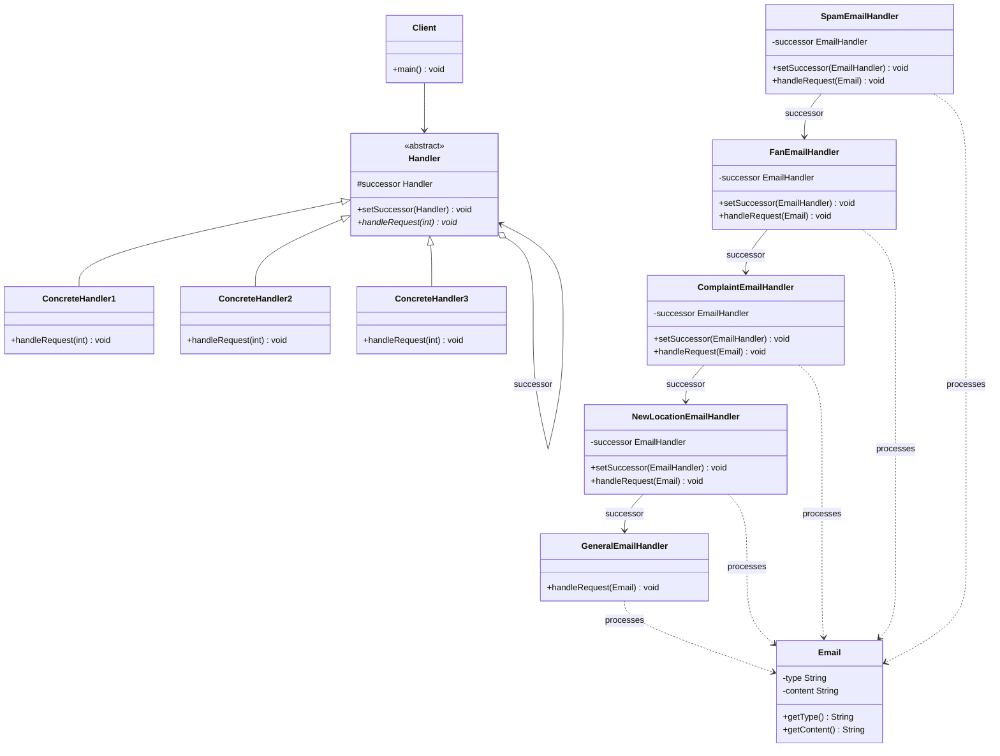

# Chain of Responsibility Pattern

## UML Diagram



## Chain of Responsibility Pattern Explanation

The Chain of Responsibility is a behavioral design pattern that lets you pass requests along a chain of handlers. Upon receiving a request, each handler decides either to process the request or to pass it to the next handler in the chain.

### Key Components

1. **Handler**: Defines an interface for handling requests and maintains a reference to the next handler in the chain.
2. **ConcreteHandler**: Handles requests it's responsible for; otherwise forwards the request to the next handler.
3. **Client**: Initiates the request to a ConcreteHandler object on the chain.

### How It Works

The pattern lets you link several handlers into one chain and, upon receiving a request, "ask" each handler whether it can process it. This way all handlers get a chance to process the request. The difference being that for the decorator, all classes handle the request, while for the chain of responsibility, exactly one of the classes in the chain handles the request.

1. A client sends a request to the first handler in the chain
2. Each handler examines the request to determine if it can handle it
3. If the handler can process the request, it does so and may end the chain
4. If the handler cannot process the request, it forwards it to the next handler
5. This continues until either a handler processes the request or the end of the chain is reached

### Real-World Use Cases

#### 1. GUI Event Handling
In graphical user interfaces (GUIs), events like mouse clicks or key presses can be handled by a chain of listeners. Each listener checks if it can handle the event, passing it along the chain if it can't.

#### 2. Web Middleware
A common example of the Chain of Responsibility pattern is the middleware in web applications. Middleware are functions that execute before the main handler of a web request, and can perform tasks such as authentication, validation, logging, or error handling.

#### 3. ATM Cash Dispensing
One of the great example of Chain of Responsibility pattern is ATM Dispense machine. The user enters the amount to be dispensed and the machine dispense amount in terms of defined currency bills such as 50$, 20$, 10$ etc.

#### 4. Approval Workflows
In a company, a designated role have particular limits to process purchase request. If person with a designated role does not have enough power to approve purchase bill, he will forward the command/request to his successor, who have more power.

#### 5. Security Systems
In security systems, access requests can be processed by a series of handlers that check permissions. For instance, one handler might check user roles, while another checks specific permissions.

#### 6. Java Servlet Filters
In the Java world, we benefit from Chain of Responsibility every day. One such classic example is Servlet Filters in Java that allow multiple filters to process an HTTP request.

### Sample Implementation

```java
// Abstract Handler
abstract class EmailHandler {
    protected EmailHandler successor;
    
    public void setSuccessor(EmailHandler successor) {
        this.successor = successor;
    }
    
    public abstract void handleRequest(Email email);
}

// Concrete Handler
class SpamEmailHandler extends EmailHandler {
    public void handleRequest(Email email) {
        if (email.getType().equals("spam")) {
            System.out.println("Spam email deleted: " + email.getContent());
        } else if (successor != null) {
            successor.handleRequest(email);
        }
    }
}

// Client usage
EmailHandler spamHandler = new SpamEmailHandler();
EmailHandler fanHandler = new FanEmailHandler();
EmailHandler complaintHandler = new ComplaintEmailHandler();

spamHandler.setSuccessor(fanHandler);
fanHandler.setSuccessor(complaintHandler);

// Process emails
Email email = new Email("fan", "I love your products!");
spamHandler.handleRequest(email);
```

### Benefits

- **Decoupling**: Reduces coupling between sender and receiver of a request
- **Flexibility**: Handlers can be added or removed dynamically
- **Single Responsibility**: Each handler focuses on one type of request
- **Open/Closed Principle**: New handlers can be added without modifying existing code

### When to Use

- When you want to decouple request senders from receivers
- When multiple objects may handle a request, and the handler isn't known beforehand
- When you want to issue a request to one of several objects without specifying the receiver explicitly
- When the set of objects that can handle a request should be specified dynamically

### Drawbacks

- No guarantee that a request will be handled (if chain ends without processing)
- Can be harder to debug due to the indirect flow of control
- Performance considerations if the chain is very long
