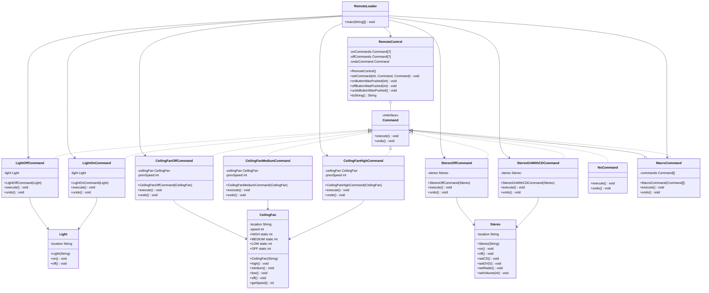

# Command Pattern

## UML Diagram



## Command Pattern Explanation

The Command Pattern encapsulates a request as an object, thereby allowing you to parameterize clients with different requests, queue or log requests, and support undoable operations.

### Key Components

1. **Command Interface**: Declares an interface for all commands, typically with an `execute()` method and an `undo()` method.
2. **Concrete Commands**: Implement the Command interface and define the binding between the Receiver object and an action.
3. **Invoker**: Asks the command to carry out the request.
4. **Receiver**: Knows how to perform the operations associated with carrying out a request.
5. **Client**: Creates a ConcreteCommand object and sets its receiver.

### Implementation

In the Remote Control example from Head First Design Patterns:

- The `Command` interface defines `execute()` and `undo()` methods
- Concrete command classes (LightOnCommand, CeilingFanHighCommand, etc.) implement the Command interface
- Each command holds a reference to a receiver object (Light, CeilingFan, Stereo, etc.)
- The `RemoteControl` class acts as the invoker, storing and executing commands
- The `RemoteLoader` acts as the client, setting up the remote control with commands

### Additional Features

- **Null Object Pattern**: The `NoCommand` object is used as a default command to avoid null checks
- **Macro Commands**: The `MacroCommand` class allows executing multiple commands with a single call
- **Undo Functionality**: Commands keep track of previous states to support undo operations

### Sample Usage

```java
// Set up the remote control
RemoteControl remoteControl = new RemoteControl();

// Create receivers
Light livingRoomLight = new Light("Living Room");
CeilingFan ceilingFan = new CeilingFan("Living Room");

// Create commands
LightOnCommand livingRoomLightOn = new LightOnCommand(livingRoomLight);
LightOffCommand livingRoomLightOff = new LightOffCommand(livingRoomLight);
CeilingFanHighCommand ceilingFanHigh = new CeilingFanHighCommand(ceilingFan);
CeilingFanOffCommand ceilingFanOff = new CeilingFanOffCommand(ceilingFan);

// Set commands to remote slots
remoteControl.setCommand(0, livingRoomLightOn, livingRoomLightOff);
remoteControl.setCommand(1, ceilingFanHigh, ceilingFanOff);

// Use the remote control
remoteControl.onButtonWasPushed(0);  // turns on living room light
remoteControl.offButtonWasPushed(0); // turns off living room light
remoteControl.onButtonWasPushed(1);  // turns ceiling fan to high
remoteControl.undoButtonWasPushed(); // undoes the last command
```

### Benefits

- Decouples the object that invokes the operation from the one that knows how to perform it
- Commands can be assembled into a composite command (macro command)
- New commands can be added without changing existing code
- Supports undo operations by storing state
- Commands can be stored in a queue for scheduled execution
- Supports logging and transaction systems
