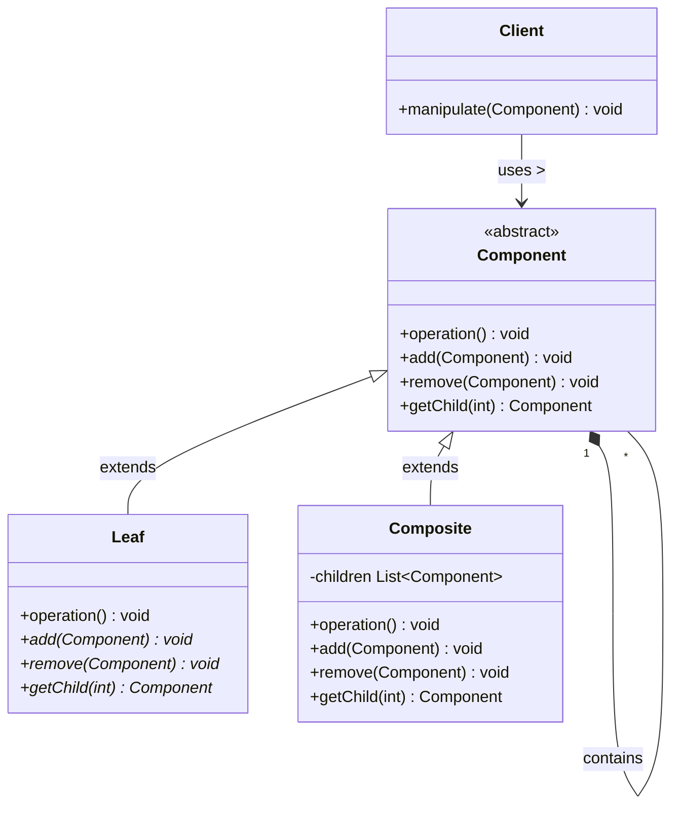
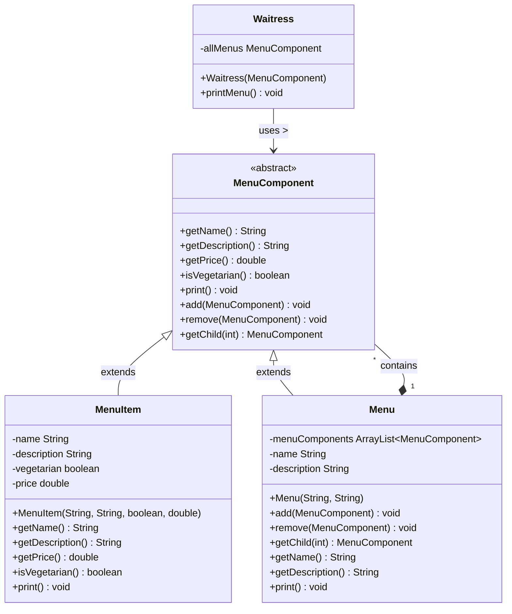

# Composite Pattern

## Core Pattern UML Diagram

## Menu Example UML Diagram from Head First Design Patterns

## Composite Pattern Explanation

The Composite Pattern allows you to compose objects into tree structures to represent part-whole hierarchies. It lets clients treat individual objects and compositions of objects uniformly.

### Key Components

1. **Component (MenuComponent)**: Defines an interface for all objects in the composition, both leaf nodes and composites. It declares operations that are common to both simple and complex elements.

2. **Leaf (MenuItem)**: Represents individual objects with no children. Implements all Component methods, though some might not make sense for a leaf (like add or remove).

3. **Composite (Menu)**: Represents complex elements that can have children. Stores child components and implements child-related operations in addition to Component methods.

4. **Client (Waitress)**: Manipulates objects in the composition through the Component interface.

### How It Works

1. The Client interacts with objects in the composition through the Component interface.
2. If the recipient is a Leaf, the request is handled directly.
3. If the recipient is a Composite, it usually forwards the request to its child components, possibly performing additional operations before or after the forwarding.

### Transparency vs. Safety

The Composite pattern can be implemented in two ways:
- **Transparent approach**: All methods (including child management) are declared in the Component interface, giving uniform access but potentially allowing invalid operations on leaves.
- **Safe approach**: Child management methods are only in the Composite class, preventing invalid operations but requiring type checking and casting.

### Benefits

- Defines class hierarchies of primitive and complex objects
- Makes it easier to add new types of components
- Provides flexibility of structure with a common interface
- Simplifies client code by allowing uniform treatment of objects
- Follows the Open/Closed Principle - new components can be added without changing existing code
