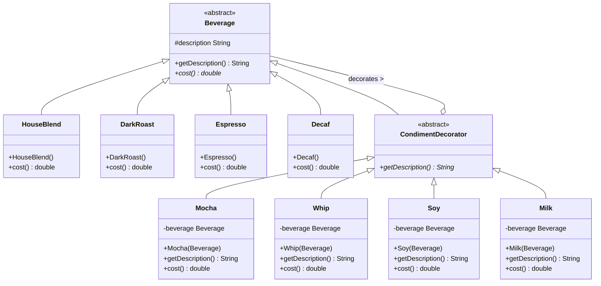

# Decorator Pattern

## UML Diagram



## Decorator Pattern Explanation

The Decorator Pattern attaches additional responsibilities to an object dynamically. Decorators provide a flexible alternative to subclassing for extending functionality.

### Key Components

1. **Component (Beverage)**: Abstract class or interface that defines the interface for objects that can have responsibilities added to them.
2. **Concrete Component (HouseBlend, DarkRoast, etc.)**: The basic object that can be decorated with additional responsibilities.
3. **Decorator (CondimentDecorator)**: Abstract class that implements the Component interface and contains a reference to a Component.
4. **Concrete Decorators (Mocha, Whip, etc.)**: Add responsibilities to the component and override methods to add their behavior before or after delegating to the wrapped component.

### Implementation

In the Starbuzz Coffee example from Head First Design Patterns:

- `Beverage` is the abstract component class with a `cost()` method and a description
- Concrete beverages like `HouseBlend`, `DarkRoast`, and `Espresso` implement the `cost()` method
- `CondimentDecorator` extends `Beverage` and serves as the base decorator class
- Concrete decorators like `Mocha`, `Whip`, `Soy`, and `Milk` add their cost to the wrapped beverage's cost
- Decorators are stacked by wrapping beverages with multiple condiments
- Each decorator adds its description to the wrapped beverage's description

### Sample Usage

```java
// Create a basic beverage
Beverage beverage = new Espresso();
System.out.println(beverage.getDescription() + " $" + beverage.cost());

// Create a beverage with decorators
Beverage beverage2 = new DarkRoast();
beverage2 = new Mocha(beverage2);
beverage2 = new Mocha(beverage2);
beverage2 = new Whip(beverage2);
System.out.println(beverage2.getDescription() + " $" + beverage2.cost());
```

### Benefits

- More flexible than static inheritance
- Responsibilities can be added or removed at runtime
- Extends an object's functionality without creating a large number of subclasses
- Follows the Open/Closed Principle: open for extension but closed for modification
