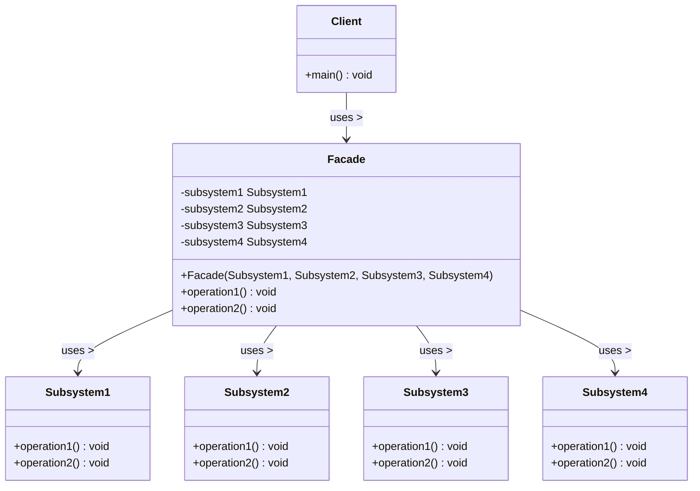

# Facade Pattern

## UML Diagram

## Facade Pattern Explanation

The Facade Pattern provides a unified interface to a set of interfaces in a subsystem. It defines a higher-level interface that makes the subsystem easier to use by reducing complexity and hiding the implementation details.

### Key Components

1. **Facade**: Provides a simplified interface to the subsystem, delegating client requests to appropriate subsystem objects.
2. **Subsystems**: Implement specialized functionality and are used by the Facade, but they don't have any knowledge of the Facade.
3. **Client**: Uses the Facade to access the subsystem functionality in a simplified way.

### How It Works

1. The Client interacts with the simplified Facade interface.
2. The Facade delegates the Client's requests to the appropriate subsystem objects.
3. The Client doesn't directly access the subsystem objects, which reduces dependencies and coupling.

### Real-World Analogy

Think of a car's ignition button. The simple action of pressing the button (Facade) hides a complex sequence of subsystem operations (checking security, engaging the starter motor, fuel injection, etc.). You don't need to understand these systems individually to start your car.

### Benefits

- Simplifies the interface to a complex subsystem
- Decouples the client from the subsystem components
- Promotes loose coupling between clients and subsystems
- Reduces compilation dependencies in large systems
- Doesn't prevent applications from using subsystem classes directly when needed
- Shields clients from subsystem components, reducing the number of objects clients deal with
