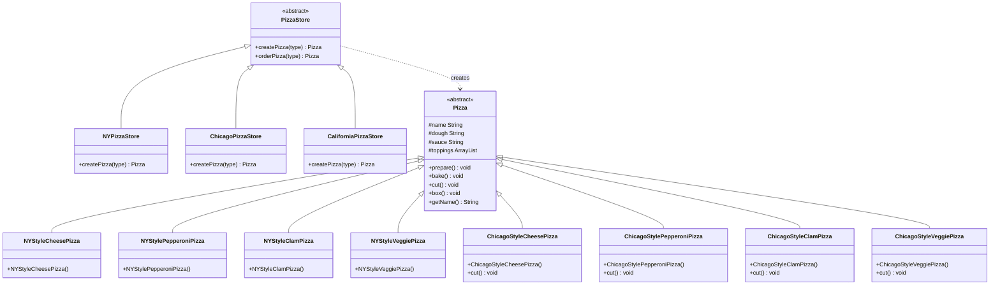

# Factory Method Pattern

## UML Diagram

## Factory Method Pattern Explanation

The Factory Method Pattern defines an interface for creating an object, but lets subclasses decide which class to instantiate. Factory Method lets a class defer instantiation to subclasses.

### Key Components

1. **Abstract Creator (PizzaStore)**: Declares the factory method that returns an object of the product type.
2. **Concrete Creators (NYPizzaStore, ChicagoPizzaStore)**: Override the factory method to return a specific concrete product.
3. **Abstract Product (Pizza)**: Defines the interface for products created by the factory method.
4. **Concrete Products (NYStyleCheesePizza, ChicagoStyleCheesePizza, etc.)**: Implement the abstract product interface.

### Implementation

In the pizza store example from Head First Design Patterns:

- The `PizzaStore` abstract class defines the `createPizza()` factory method
- Subclasses like `NYPizzaStore` and `ChicagoPizzaStore` implement the factory method to create region-specific pizzas
- All pizzas share the same interface defined by the `Pizza` abstract class
- Concrete pizza classes implement specific styles for each region
