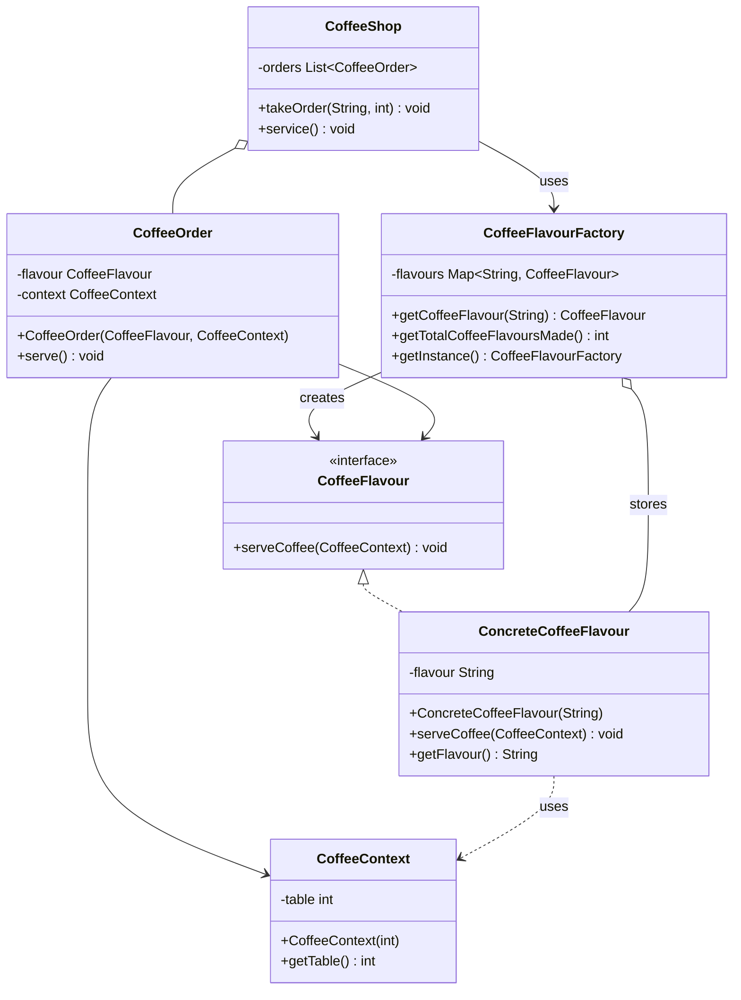

# Flyweight Pattern

## UML Diagram



## Flyweight Pattern Explanation

The Flyweight Pattern is a structural design pattern that lets you fit more objects into the available amount of RAM by sharing common parts of state between multiple objects instead of keeping all of the data in each object.

### Key Concepts

**Intrinsic State**: State that is invariant, context-independent and shareable (e.g., coffee flavour, character font)

**Extrinsic State**: State that is variant, context-dependent and can't be shared (e.g., table number, character position)

### Key Components

1. **Flyweight Interface (CoffeeFlavour)**: Declares methods that flyweights can use to receive and act on extrinsic state
2. **Concrete Flyweight (ConcreteCoffeeFlavour)**: Implements the Flyweight interface and stores intrinsic state
3. **Context (CoffeeContext)**: Contains extrinsic state that varies across flyweights
4. **Flyweight Factory (CoffeeFlavourFactory)**: Manages flyweight instances and ensures they are shared properly
5. **Client (CoffeeShop)**: Maintains references to flyweights and computes or stores extrinsic state

### How It Works

1. **Separation of State**: The pattern separates object state into intrinsic (shared) and extrinsic (unique) parts
2. **Flyweight Sharing**: Objects with the same intrinsic state share a single flyweight instance
3. **Extrinsic State Management**: Clients pass extrinsic state to flyweight methods when needed
4. **Factory Management**: A factory ensures flyweights are created once and reused

### Implementation Details

In the coffee shop example:
- **Intrinsic State**: Coffee flavour (Espresso, Cappuccino, etc.) - shared among all orders of the same type
- **Extrinsic State**: Table number - unique for each order
- **Memory Savings**: Instead of creating separate objects for each coffee order, we share flavour objects and pass table numbers as parameters

### Sample Usage

```java
// Client code
CoffeeShop shop = new CoffeeShop();

// Multiple orders of the same flavour share the same flyweight
shop.takeOrder("Espresso", 1);
shop.takeOrder("Espresso", 2);
shop.takeOrder("Cappuccino", 3);
shop.takeOrder("Espresso", 4);  // Reuses existing Espresso flyweight

shop.service();  // Serves all orders

// Only 2 flyweight objects created despite 4 orders
System.out.println("Total flavours created: " + 
    CoffeeFlavourFactory.getInstance().getTotalCoffeeFlavoursMade());
```

## Use Cases

### 1. Text Editors
Text editors can store each unique character style (like font or color) only once and reuse it, rather than duplicating it for every character.
- **Intrinsic**: Font family, size, style
- **Extrinsic**: Position, character value

### 2. Game Development
Game development, where objects like trees, rocks, or bullets can be managed as flyweights to reduce memory consumption. When you've got an entire forest of individual trees filling the screen, flyweights help manage millions of polygons efficiently.
- **Intrinsic**: Tree model, texture, mesh data
- **Extrinsic**: Position, rotation, scale

### 3. GUI Applications
Icons in desktop applications can optimize memory usage by sharing common parts of the icons (intrinsic state), such as the image and basic properties, among multiple icon instances.
- **Intrinsic**: Icon image, default size
- **Extrinsic**: Screen position, selection state

### 4. Web Applications
- **Intrinsic**: CSS styles, image resources
- **Extrinsic**: Element position, content

## Benefits

- **Memory Optimization**: Useful when dealing with large numbers of objects with simple repeated elements that would use a large amount of memory if individually stored
- **Performance**: Reduces object creation overhead
- **Scalability**: Enables applications to handle more objects within memory constraints
- **Resource Sharing**: Maximizes reuse of common object components

## When to Use

- You need to support a large number of similar objects
- Storage costs are high due to object quantity
- Most object state can be made extrinsic
- Groups of objects can be replaced by few shared objects
- The application doesn't depend on object identity

## Considerations

- **Complexity**: Introduces additional complexity in state management
- **Runtime Costs**: May introduce runtime costs when calculating extrinsic state
- **Thread Safety**: Flyweights must be thread-safe if used in concurrent environments
- **Factory Management**: Requires careful factory implementation to ensure proper sharing

The Flyweight pattern is particularly valuable in scenarios where memory usage is a critical concern and you have many objects with shared characteristics.
