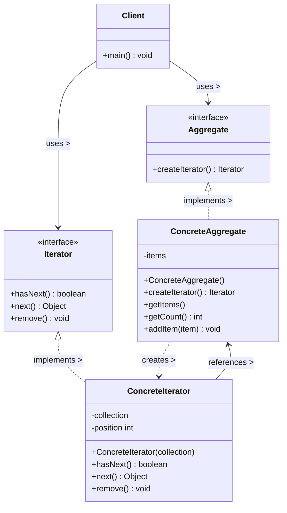

# Iterator Pattern

## UML Diagram

## Iterator Pattern Explanation

The Iterator Pattern provides a way to access the elements of an aggregate object sequentially without exposing its underlying representation.

### Key Components

1. **Iterator (Iterator)**: Defines an interface for accessing and traversing elements.
2. **ConcreteIterator**: Implements the Iterator interface and keeps track of the current position in the traversal.
3. **Aggregate (Aggregate)**: Defines an interface for creating an Iterator object.
4. **ConcreteAggregate**: Implements the Aggregate interface and returns an instance of the appropriate ConcreteIterator.
5. **Client**: Uses Iterators to access and traverse aggregates.

### How It Works

1. A Client requests an iterator from an Aggregate object.
2. The Aggregate creates and returns a ConcreteIterator.
3. The Client uses the Iterator interface to traverse the elements without knowing the underlying structure.
4. The ConcreteIterator keeps track of the current element and knows how to navigate the Aggregate.

### Single Responsibility Principle

The Iterator Pattern applies the Single Responsibility Principle by separating:
- The collection's responsibility (storing elements)
- The iteration responsibility (traversing elements)

### Benefits

- Simplifies the aggregate interface by removing traversal operations
- Supports multiple traversals of the same aggregate simultaneously
- Provides a uniform way to access different aggregate structures
- Allows for different traversal algorithms without changing the aggregate
- Decouples clients from the implementation details of the collection
