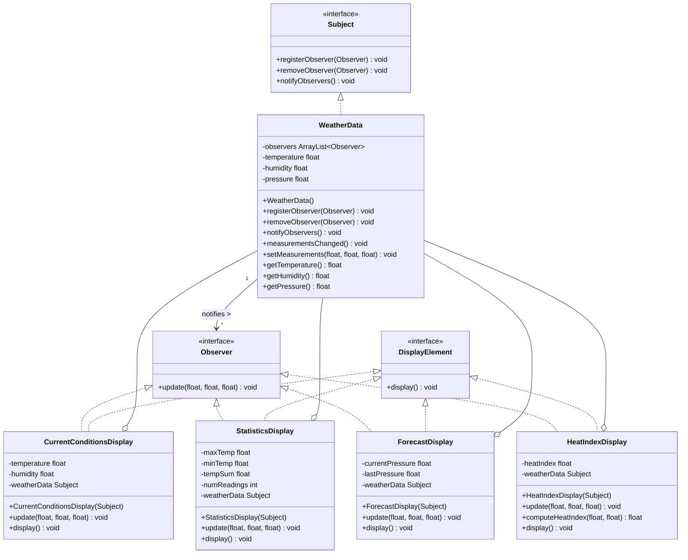

# Observer Pattern

## UML Diagram

## Observer Pattern Explanation

The Observer Pattern defines a one-to-many dependency between objects so that when one object changes state, all its dependents are notified and updated automatically.

### Key Components

1. **Subject (Subject interface)**: Knows its observers and provides methods to register and remove observers.
2. **Concrete Subject (WeatherData)**: Implements the Subject interface, maintains state, and notifies observers when state changes.
3. **Observer (Observer interface)**: Defines an update method that gets called when the Subject changes.
4. **Concrete Observers (CurrentConditionsDisplay, StatisticsDisplay, etc.)**: Implement the Observer interface to receive and use the updated state from the Subject.

### Implementation

In the Weather Station example from Head First Design Patterns:

- `WeatherData` is the Subject that tracks temperature, humidity, and pressure
- When measurements change, `WeatherData` notifies all registered observers
- Display elements (CurrentConditionsDisplay, StatisticsDisplay, etc.) are Observers
- Each display registers with the WeatherData subject to receive updates
- Displays implement both Observer and DisplayElement interfaces
- When notified of changes, each display updates its data and refreshes its display

### Benefits

- Loose coupling between the subject and observers
- Support for broadcast communication
- Dynamic relationships between subjects and observers at runtime
- The Subject doesn't need to know anything about the concrete Observer classes
