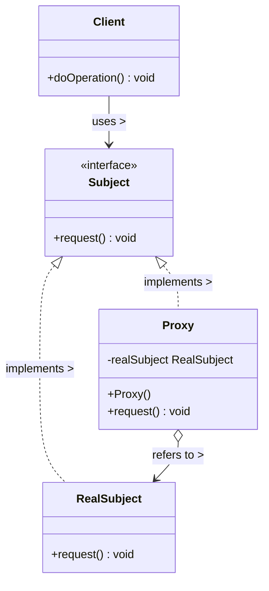

# Proxy Pattern

## UML Diagram (Base Case)

## Proxy Pattern Explanation

The Proxy Pattern provides a surrogate or placeholder for another object to control access to it.

### Key Components

1. **Subject**: An interface defining common operations for RealSubject and Proxy.
2. **RealSubject**: The real object that the proxy represents.
3. **Proxy**: Maintains a reference to the RealSubject and controls access to it.
4. **Client**: Interacts with the Subject interface, unaware whether it's working with the RealSubject or a Proxy.

### Types of Proxies

- **Remote Proxy**: Represents an object in a different address space.
- **Virtual Proxy**: Creates expensive objects on demand.
- **Protection Proxy**: Controls access to the original object.
- **Smart Reference**: Adds additional actions when an object is accessed.

### How It Works

1. The Proxy implements the same interface as the RealSubject.
2. The Client uses the Subject interface to interact with either the RealSubject or the Proxy.
3. The Proxy maintains a reference to the RealSubject and forwards requests to it when appropriate.
4. The Proxy may perform additional operations before or after forwarding requests.

### Benefits

- Controls access to the original object
- Allows for lazy initialization and loading of expensive objects
- Adds additional behavior when accessing an object
- Separates clients from the complexities of creating and managing the real object
- Can implement caching for better performance
