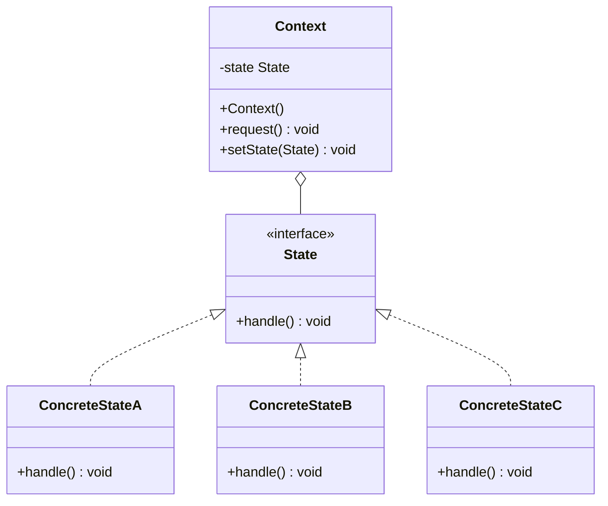
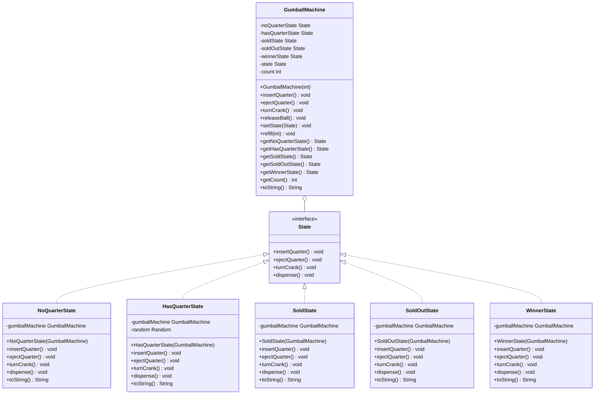

# State Pattern

## Core Pattern UML Diagram

## Gumball Machine Example UML Diagram from Head First Design Patterns

## State Pattern Explanation

The State Pattern allows an object to alter its behavior when its internal state changes. The object will appear to change its class.

### Key Components

1. **Context (GumballMachine)**: Maintains an instance of a ConcreteState subclass that defines the current state. The Context delegates state-specific behavior to the current state object.

2. **State (State)**: Defines an interface for encapsulating the behavior associated with a particular state of the Context.

3. **Concrete States (NoQuarterState, HasQuarterState, etc.)**: Each subclass implements behavior associated with a specific state of the Context.

### How It Works

1. The Context delegates state-specific requests to the current ConcreteState object.
2. A ConcreteState subclass can store a reference back to the Context if needed.
3. When the internal state of the Context changes, a new ConcreteState object is created and assigned to the Context.
4. The Context's behavior changes along with its internal state, making it appear as if the Context changed its class.

### State vs. Strategy Pattern

While the State and Strategy patterns have similar structures, they solve different problems:
- **State Pattern**: Allows an object to change its behavior when its internal state changes.
- **Strategy Pattern**: Allows selecting an algorithm at runtime from a family of algorithms.

### Benefits

- Encapsulates state-specific behavior in separate classes
- Makes state transitions explicit
- Eliminates large, monolithic conditionals for state-based behaviors
- Allows states to be shared among multiple instances
- Makes adding new states easy without changing existing state or context classes
