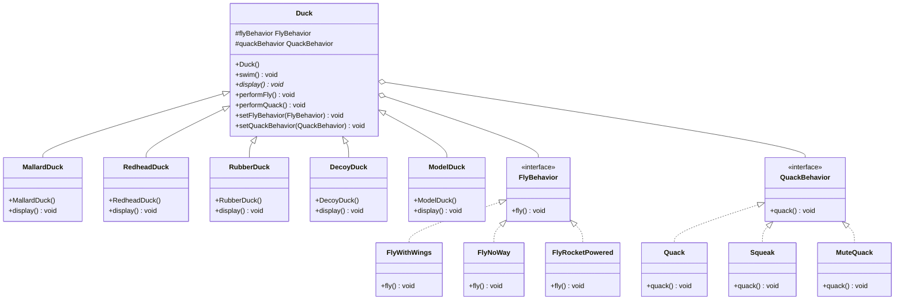

# Strategy Pattern

## UML Diagram

## Strategy Pattern Explanation

The Strategy Pattern defines a family of algorithms, encapsulates each one, and makes them interchangeable. Strategy lets the algorithm vary independently from clients that use it.

### Key Components

1. **Context (Duck)**: Maintains a reference to a Strategy object and delegates to it instead of implementing the behavior directly.
2. **Strategy Interface (FlyBehavior, QuackBehavior)**: Defines an interface common to all supported algorithms.
3. **Concrete Strategies (FlyWithWings, FlyNoWay, Quack, Squeak, etc.)**: Implements the algorithm using the Strategy interface.

### Implementation

In the Duck example from Head First Design Patterns:

- `Duck` is the abstract base class that delegates flying and quacking behavior to strategy objects
- Each concrete duck (MallardDuck, RubberDuck, etc.) can be instantiated with different behavior implementations
- `FlyBehavior` and `QuackBehavior` are the strategy interfaces
- Concrete implementations like `FlyWithWings`, `FlyNoWay`, `Quack`, and `MuteQuack` provide specific behaviors
- Behaviors can be changed at runtime using the setter methods in the Duck class

### Benefits

- Eliminates conditional statements for different behaviors
- Makes it easy to add new behaviors without changing existing code
- Allows behavior switching at runtime
- Isolates the behavior implementation from the classes that use it
