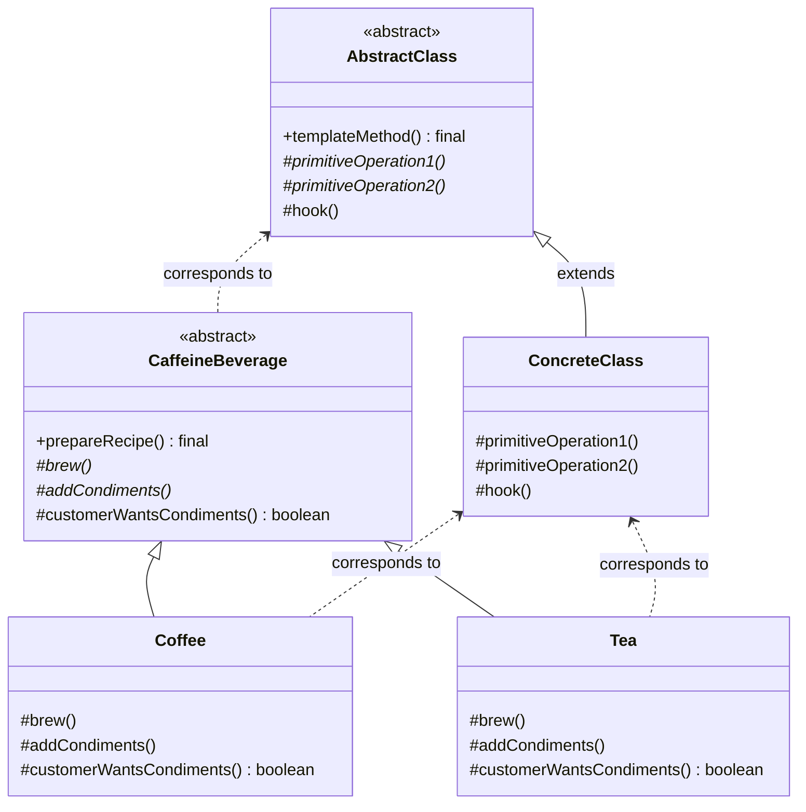

# Template Method Pattern

## UML Diagram

## Template Method Pattern Explanation

The Template Method Pattern defines the skeleton of an algorithm in a method, deferring some steps to subclasses. It lets subclasses redefine certain steps of an algorithm without changing the algorithm's structure.

### Key Components

1. **AbstractClass (CaffeineBeverage)**: Contains the template method which defines the algorithm as a series of steps. Some of these steps are implemented in the abstract class, while others are abstract and must be implemented by subclasses.

2. **ConcreteClass (Coffee, Tea)**: Implements the primitive operations required by the template method but left undefined in the abstract class.

### How It Works

1. The template method in the AbstractClass calls a series of operations in a specific sequence.
2. Some of these operations are defined in the AbstractClass itself.
3. Some operations are left abstract and must be implemented by subclasses.
4. Some operations are "hooks" with default implementations that subclasses can override if needed.
5. The algorithm's structure remains unchanged regardless of how subclasses implement the required steps.

### Hooks

Hooks are methods that have a default implementation in the AbstractClass but can be overridden by subclasses. They provide optional customization points in the algorithm.

In the CaffeineBeverage example, `customerWantsCondiments()` is a hook that returns true by default but can be overridden to allow the customer to decline condiments.

### Hollywood Principle

"Don't call us, we'll call you." High-level components (AbstractClass) determine when to call low-level components (ConcreteClass). Subclasses can supply implementation details, but the overall flow of control is dictated by the template method in the abstract class.

### Benefits

- Eliminates code duplication by moving common code to the abstract class
- Enables the "open-closed principle" - open for extension but closed for modification
- Provides a framework for controlling algorithm implementation
- Allows for specific customization points while maintaining overall algorithm structure
