# Java Logging System

## Class Diagram

```mermaid
classDiagram
    class Logger {
        -INSTANCE: Logger
        -rootHandler: LogHandler
        +getInstance(): Logger
        +log(LogLevel, String): void
        +debug(String): void
        +warn(String): void
        +error(String): void
    }

    class LogConfiguration {
        -debug: LogHandler
        -warn: LogHandler
        -error: LogHandler
        +build(): LogHandler
        +addAppenderForLevel(LogAppender, LogLevel): void
    }

    class LogMessage {
        +level: LogLevel
        +message: String
        +timestamp: long
    }

    class LogLevel {
        <<enumeration>>
        DEBUG
        WARN
        ERROR
    }

    class LogHandler {
        <<abstract>>
        -next: LogHandler
        -appenders: List~LogAppender~
        +setNext(LogHandler): void
        +subscribe(LogAppender): void
        +notifyAllAppenders(LogMessage): void
        +handle(LogMessage): void
        #canHandle(LogLevel): boolean*
    }

    class DebugLogHandler {
        #canHandle(LogLevel): boolean
    }

    class WarnLogHandler {
        #canHandle(LogLevel): boolean
    }

    class ErrorLogHandler {
        #canHandle(LogLevel): boolean
    }

    class LogAppender {
        <<interface>>
        +append(LogMessage): void
    }

    class ConsoleLogAppender {
        -formatter: LogFormatter
        +append(LogMessage): void
    }

    class FileLogAppender {
        -formatter: LogFormatter
        -filePath: String
        +append(LogMessage): void
    }

    class LogFormatter {
        <<interface>>
        +format(LogMessage): String
    }

    class TextLogFormatter {
        -FORMATTER: DateTimeFormatter
        +format(LogMessage): String
    }

    class JsonLogFormatter {
        -FORMATTER: DateTimeFormatter
        +format(LogMessage): String
    }

    Logger --> LogConfiguration
    Logger --> LogHandler
    Logger --> LogMessage
    Logger --> LogLevel

    LogConfiguration --> LogHandler
    LogConfiguration --> LogAppender
    LogConfiguration --> LogLevel

    LogHandler <|-- DebugLogHandler
    LogHandler <|-- WarnLogHandler
    LogHandler <|-- ErrorLogHandler
    LogHandler --> LogMessage
    LogHandler --> LogAppender

    LogAppender <|.. ConsoleLogAppender
    LogAppender <|.. FileLogAppender
    LogAppender --> LogMessage

    ConsoleLogAppender --> LogFormatter
    FileLogAppender --> LogFormatter

    LogFormatter <|.. TextLogFormatter
    LogFormatter <|.. JsonLogFormatter
    LogFormatter --> LogMessage
```



## Design Patterns Used

### 1. Singleton Pattern
- **Class**: `Logger`
- **Purpose**: Ensures only one logger instance exists across the application

### 2. Chain of Responsibility Pattern
- **Classes**: `LogHandler`, `DebugLogHandler`, `WarnLogHandler`, `ErrorLogHandler`
- **Purpose**: Allows log messages to be processed by the appropriate handler based on log level

### 3. Observer Pattern
- **Classes**: `LogHandler` (Subject), `LogAppender` implementations (Observers)
- **Purpose**: Notifies all subscribed appenders when a log message needs to be processed

### 4. Strategy Pattern
- **Classes**: `LogFormatter` interface, `TextLogFormatter`, `JsonLogFormatter`
- **Purpose**: Allows different formatting strategies to be used interchangeably

## Usage Example

```java
// Get logger instance
Logger logger = Logger.getInstance();

// Log messages at different levels
logger.debug("This is a debug message");
logger.warn("This is a warning message");
logger.error("This is an error message");

// Direct logging with level
logger.log(LogLevel.ERROR, "Custom error message");
```

## Output Examples

### Console Output (Text Format)
```
22-07-2025 14:30:15 [DEBUG] - This is a debug message
22-07-2025 14:30:16 [WARN] - This is a warning message
22-07-2025 14:30:17 [ERROR] - This is an error message
```

### File Output (JSON Format)
```json
{
    "timestamp": "22-07-2025 14:30:17",
    "level": "ERROR",
    "message": "This is an error message"
}
```

## Package Structure

```
logger/
├── Logger.java                    # Main logger class
├── LogConfiguration.java   # Configuration utility
├── LogLevel.java                  # Log level enumeration
├── LogMessage.java                # Log message record
├── handler/
│   ├── LogHandler.java           # Abstract handler
│   ├── DebugLogHandler.java      # Debug level handler
│   ├── WarnLogHandler.java       # Warning level handler
│   └── ErrorLogHandler.java      # Error level handler
├── appender/
│   ├── LogAppender.java          # Appender interface
│   ├── ConsoleLogAppender.java   # Console output
│   └── FileLogAppender.java      # File output
└── formatter/
    ├── LogFormatter.java         # Formatter interface
    ├── TextLogFormatter.java     # Plain text format
    └── JsonLogFormatter.java     # JSON format
```