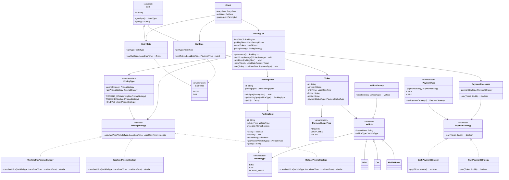

```mermaid
classDiagram
    class ParkingLot {
        -INSTANCE: ParkingLot
        -parkingFloors: List~ParkingFloor~
        -activeTickets: List~Ticket~
        -pricingStrategy: PricingStrategy
        +getInstance(): ParkingLot
        +setPricingStrategy(PricingStrategy): void
        +addFloor(ParkingFloor): void
        +park(Vehicle, LocalDateTime): Ticket
        +exit(String, LocalDateTime, PaymentType): void
    }

    class ParkingFloor {
        -id: String
        -parkingSpots: List~ParkingSpot~
        +addSpot(ParkingSpot): void
        +getParkingSpot(VehicleType): ParkingSpot
        +getId(): String
    }

    class ParkingSpot {
        -id: String
        -vehicleType: VehicleType
        -available: AtomicBoolean
        +take(): boolean
        +vacate(): void
        +isAvailable(): boolean
        +getAllowedVehicleType(): VehicleType
        +getId(): String
    }

    class Ticket {
        -id: String
        -vehicle: Vehicle
        -entryTime: LocalDateTime
        -floorId: String
        -spotId: String
        -paymentStatusType: PaymentStatusType
    }

    class Gate {
        <<abstract>>
        -id: String
        +gateType(): GateType
        +getId(): String
    }

    class EntryGate {
        +getType: GateType
        +park(Vehicle, LocalDateTime): Ticket
    }

    class ExitGate {
        +getType: GateType
        +exit(Ticket, LocalDateTime, PaymentType): void
    }

    class GateType {
        <<enumeration>>
        ENTRY
        EXIT
    }

    class PaymentStrategy {
        <<interface>>
        +pay(Ticket, double): boolean
    }

    class CardPaymentStrategy {
        +pay(Ticket, double): boolean
    }

    class CashPaymentStrategy {
        +pay(Ticket, double): boolean
    }

    class PaymentProcessor {
        -paymentStrategy: PaymentStrategy
        +pay(Ticket, double): boolean
    }

    class PaymentStatusType {
        <<enumeration>>
        PENDING
        COMPLETED
        FAILED
    }

    class PaymentType {
        <<enumeration>>
        -paymentStrategy: PaymentStrategy
        CASH
        CARD
        +getPaymentStrategy(): PaymentStrategy
    }

    class PricingStrategy {
        <<interface>>
        +calculatePrice(VehicleType, LocalDateTime, LocalDateTime): doulbe
    }

    class WorkingDayPricingStrategy {
        +calculatePrice(VehicleType, LocalDateTime, LocalDateTime): doulbe
    }

    class WeekendPricingStrategy {
        +calculatePrice(VehicleType, LocalDateTime, LocalDateTime): doulbe
    }

    class HolidayPricingStrategy {
        +calculatePrice(VehicleType, LocalDateTime, LocalDateTime): doulbe
    }

    class PricingType {
        <<enumeration>>
        WORKING_DAY(WorkingDayPricingStrategy)
        WEEKEND(WeekendPricingStrategy)
        HOLIDAY(HolidayPricingStrategy)
        -pricingStrategy: PricingStrategy
        +getPricingStrategy: PricingStrategy
    }

     class VehicleType {
        <<enumeration>>
        BIKE
        CAR
        MOBILE_HOME
     }

     class Vehicle {
        <<abstract>>
        -licensePlate: String
        -vehicleType: VehicleType
     }

     class Bike {

     }

     class Car {

     }

     class MobileHome {

     }

     class VehicleFactory {
        +create(String, VehicleType): Vehicle
     }

     class Client {
        -entryGate: EntryGate
        -exitGate: ExitGate
        -parkingLot: ParkingLot
     }

    Client --> EntryGate
    Client --> ExitGate
    Client --> ParkingLot
    Vehicle --> VehicleType
    VehicleFactory --> Vehicle
    ParkingLot --> PricingStrategy
    ParkingLot --> ParkingFloor
    ParkingLot --> Ticket
    ParkingLot --> PricingType
    ParkingLot --> PaymentProcessor
    PaymentProcessor --> PaymentStrategy
    Ticket --> PaymentStatusType
    Ticket --> Vehicle
    PaymentType --> PaymentStrategy
    ParkingSpot --> VehicleType
    ParkingFloor --> ParkingSpot
    ExitGate --> GateType
    EntryGate --> GateType
    PricingType --> PricingStrategy
    
    Gate <|-- EntryGate
    Gate <|-- ExitGate

    Vehicle <|-- Bike
    Vehicle <|-- Car
    Vehicle <|-- MobileHome
    
    PricingStrategy <|.. WorkingDayPricingStrategy
    PricingStrategy <|.. WeekendPricingStrategy
    PricingStrategy <|.. HolidayPricingStrategy

    PaymentStrategy <|.. CashPaymentStrategy
    PaymentStrategy <|.. CardPaymentStrategy

```